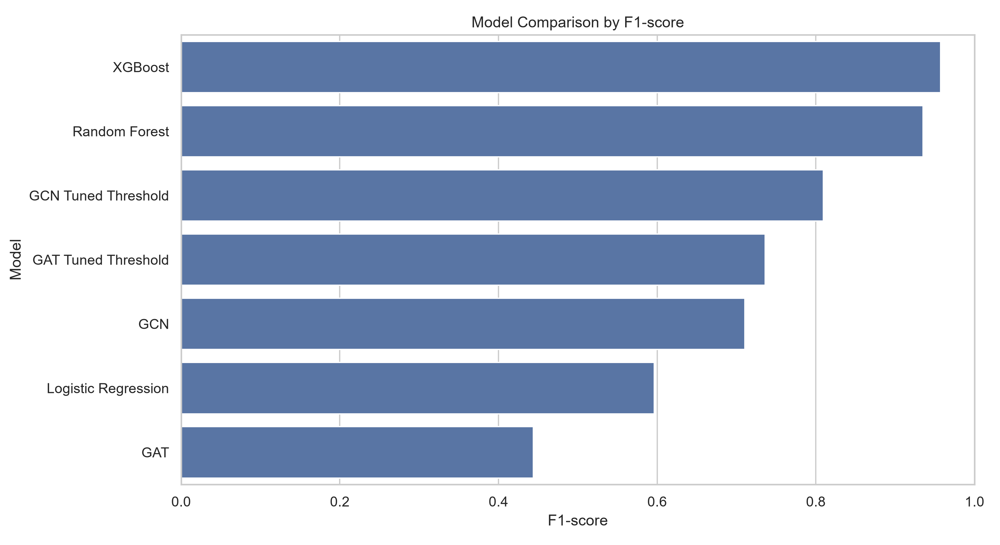
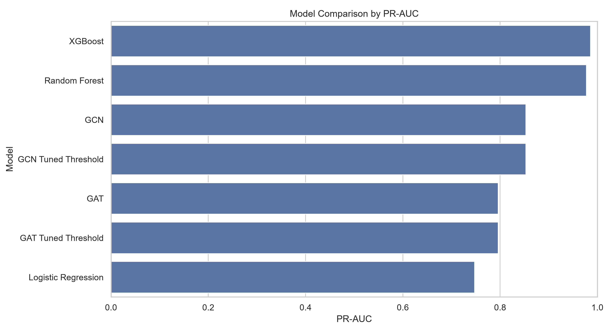
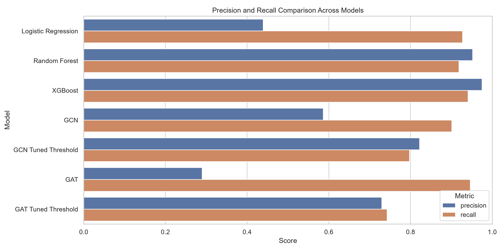
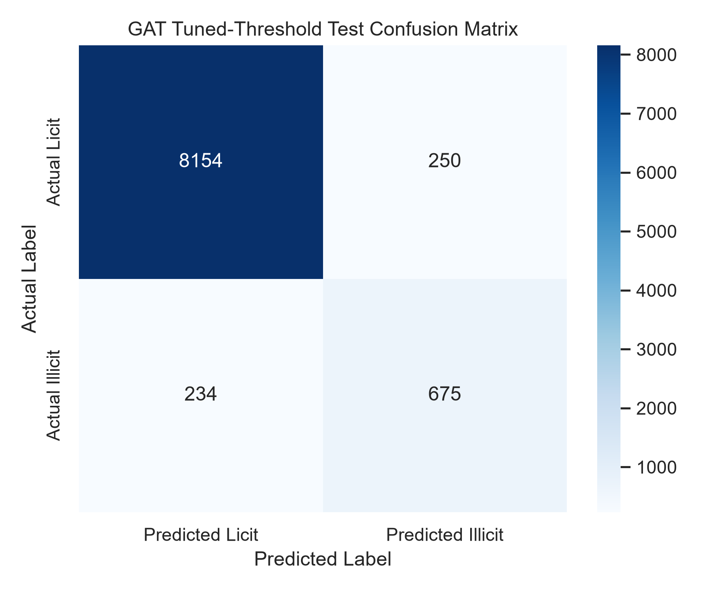
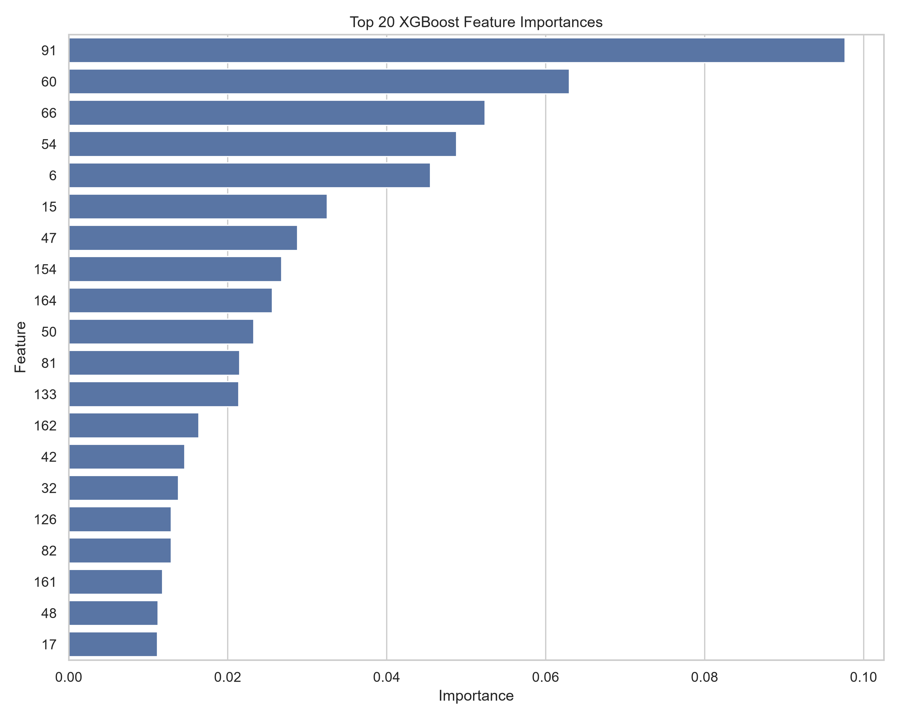
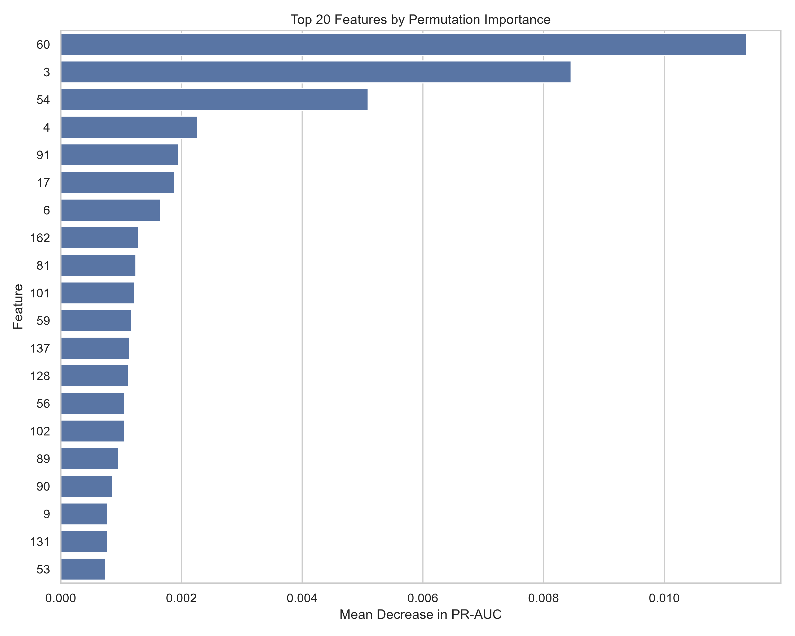
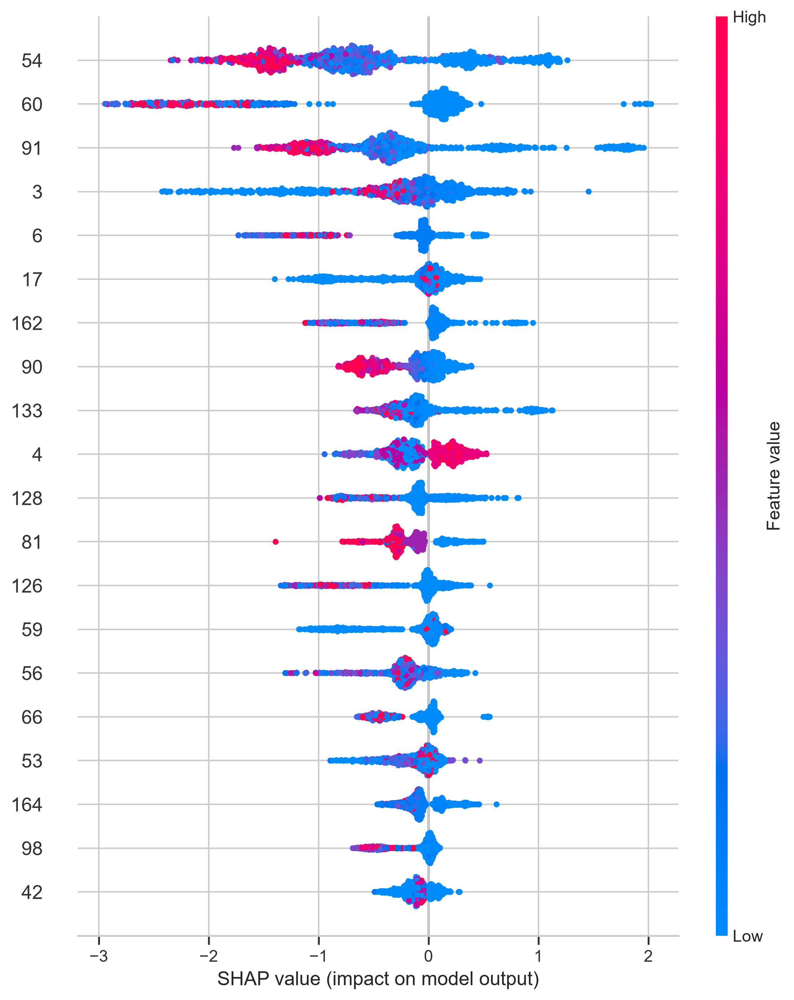
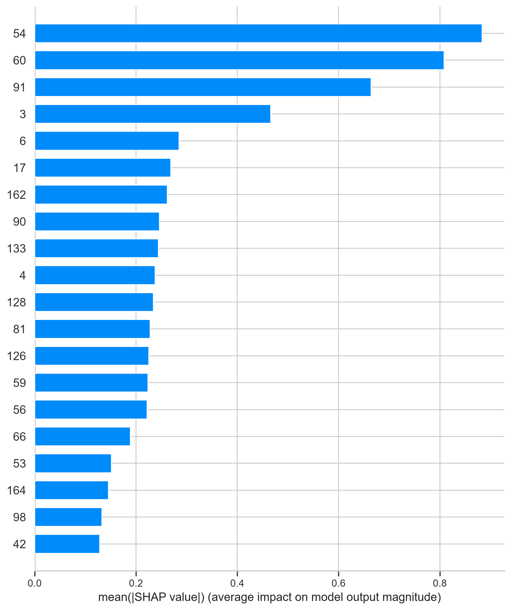
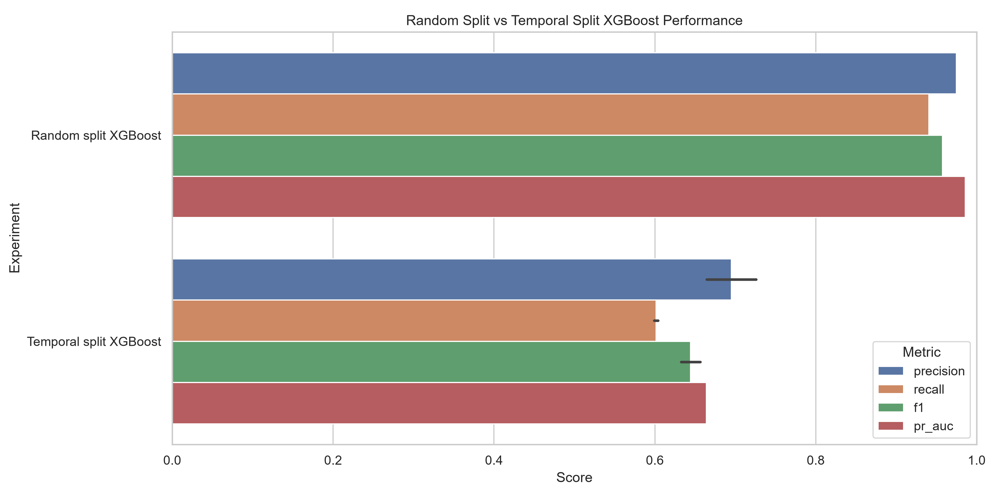

# Explainable Graph-Based Financial Fraud Detection Using Transaction Network Data

**Major Research Project — M.Sc. in Data Science and Analytics**

**Author:** Avikumar Patel<br>
**Institution:** Toronto Metropolitan University<br>
**Program:** M.Sc. in Data Science and Analytics<br>
**Supervisor:** Dr. Isaac Woungang

---

## Project Overview

Financial fraud and anti-money-laundering detection are challenging because illicit transactions are relatively rare, highly imbalanced, and often connected through complex transaction networks.

This Major Research Project investigates **illicit Bitcoin transaction detection using the Elliptic Bitcoin transaction dataset**. The study compares strong traditional tabular machine-learning models with graph neural networks to examine whether transaction-network structure provides additional predictive value.

The project evaluates:

- Logistic Regression
- Random Forest
- XGBoost
- Graph Convolutional Network (GCN)
- Graph Attention Network (GAT)

In addition to predictive performance, the project investigates:

- class-imbalance handling;
- validation-based decision-threshold tuning;
- model explainability using feature importance, permutation importance, and SHAP;
- graph-based learning using transaction relationships;
- temporal robustness under future-period evaluation.

The primary finding is that **XGBoost achieved the strongest overall predictive performance**, while graph neural networks provided useful relational learning and high illicit-transaction recall but did not outperform the strongest tabular baselines under the main experimental setting.

---

## Research Motivation

Traditional fraud-detection models generally treat transactions as independent observations. Cryptocurrency transactions, however, naturally form networks in which transactions are linked through the movement of funds.

This creates two complementary modeling approaches:

1. **Tabular machine learning**, using transaction-level numerical attributes.
2. **Graph neural networks**, using both transaction attributes and relationships between transactions.

The project therefore examines whether incorporating graph connectivity improves illicit-transaction detection compared with strong conventional machine-learning models.

A further objective is to determine whether strong benchmark performance remains stable when models are evaluated on **future transaction periods**, which more closely reflects real-world deployment.

---

## Research Questions

This project addresses the following questions:

1. How effectively can traditional machine-learning models detect illicit Bitcoin transactions using anonymized transaction features?
2. Do graph neural networks such as GCN and GAT improve performance by incorporating transaction-network structure?
3. How does validation-based threshold tuning affect the precision-recall balance of graph models?
4. Which anonymized transaction features have the greatest influence on the strongest-performing tabular model?
5. How well does the strongest model generalize when evaluated on future transaction periods?

---

# Dataset

The project uses the **Elliptic Bitcoin transaction dataset**, which represents Bitcoin transactions as a graph.

Each transaction is represented as a node, transaction flows are represented as edges, and each node contains anonymized numerical transaction features.

## Dataset Summary

| Property | Value |
|---|---:|
| Total transaction nodes | 203,769 |
| Directed transaction edges | 234,355 |
| Node features used for modeling | 165 |
| Labeled nodes | 46,564 |
| Unlabeled nodes | 157,205 |
| Licit labeled transactions | 42,019 |
| Illicit labeled transactions | 4,545 |
| Illicit proportion among labeled nodes | 9.76% |

The supervised labels used in this project are:

- `0` — Licit
- `1` — Illicit
- `-1` — Unknown / Unlabeled

Unknown transactions are excluded from supervised tabular-model training and evaluation.

For graph neural networks, however, the complete graph is retained so that unlabeled nodes can still contribute structural neighborhood information during message passing.

---

## Dataset Setup

The raw Elliptic dataset is **not distributed with this repository**.

After obtaining the dataset from an authorized source, place the following files inside:

```text
data/raw/elliptic_bitcoin_dataset/
```

Required files:

```text
elliptic_txs_classes.csv
elliptic_txs_edgelist.csv
elliptic_txs_features.csv
```

The notebooks expect this directory structure before preprocessing begins.

Raw and generated datasets are excluded from version control through `.gitignore`.

---

# Data Preparation

The raw feature file contains transaction identifiers, time-step information, and anonymized transaction attributes.

The preprocessing pipeline includes:

- loading the feature, class, and edge files;
- renaming transaction ID and time-step columns;
- merging transaction features with labels;
- cleaning class labels;
- mapping licit and illicit classes to binary labels;
- excluding unknown labels from supervised tabular training;
- checking missing values;
- preserving the complete graph structure for GNN experiments;
- generating reproducible training, validation, and test partitions.

After preprocessing, the supervised labeled dataset contains:

```text
46,564 transactions
```

consisting of:

```text
42,019 licit transactions
4,545 illicit transactions
```

---

# Main Train / Validation / Test Split

For the primary controlled comparison, labeled transactions are divided using a **stratified 60/20/20 train-validation-test split**.

| Split | Total | Licit | Illicit |
|---|---:|---:|---:|
| Training | 27,938 | 25,211 | 2,727 |
| Validation | 9,313 | 8,404 | 909 |
| Test | 9,313 | 8,404 | 909 |

The stratified procedure preserves approximately the same class distribution across all three subsets.

This split is used as the main benchmark so that all model families can be compared under consistent conditions.

---

# Graph Representation

The Elliptic transaction network contains:

```text
203,769 nodes
234,355 directed edges
165 node features
```

For the baseline GCN and GAT experiments, reverse edges are added to the original directed edge list for message passing.

This produces:

```text
468,710 message-passing edge entries
```

The complete graph contains:

```text
46,564 labeled nodes
157,205 unlabeled nodes
```

Training, validation, and test masks ensure that supervised loss and evaluation are performed only on the appropriate labeled nodes.

---

# Project Workflow

```text
Raw Elliptic Dataset
        ↓
Data Loading and Label Cleaning
        ↓
Exploratory Data Analysis
        ↓
Train / Validation / Test Split
        ↓
Tabular Machine-Learning Baselines
(Logistic Regression, Random Forest, XGBoost)
        ↓
XGBoost Interpretation
(Feature Importance, Permutation Importance, SHAP)
        ↓
Graph Data Preparation
        ↓
Graph Neural Networks
(GCN and GAT)
        ↓
Validation-Based Threshold Tuning
        ↓
Comparative Model Evaluation
        ↓
Temporal Robustness Analysis
        ↓
Final Analysis and Conclusions
```

---

# Models

## 1. Logistic Regression

Logistic Regression is used as a simple linear baseline.

It provides an interpretable reference model and helps determine how effectively the classification problem can be addressed using a linear decision boundary.

Numerical features are standardized, and class imbalance is handled using balanced class weights.

---

## 2. Random Forest

Random Forest provides a strong non-linear ensemble baseline.

The model can capture complex feature interactions and non-linear relationships while remaining relatively robust to noise.

Balanced class weighting is used to reduce majority-class dominance.

---

## 3. XGBoost

XGBoost is used as the primary gradient-boosted tree model because boosted decision trees are highly competitive for structured numerical data.

The implementation incorporates:

- class-imbalance adjustment using `scale_pos_weight`;
- row subsampling;
- feature subsampling;
- regularized tree depth;
- probabilistic binary classification.

XGBoost achieved the strongest overall predictive performance in the primary experiment.

---

## 4. Graph Convolutional Network

A Graph Convolutional Network is implemented to incorporate transaction-network structure.

The GCN combines each transaction's numerical features with information propagated from neighboring nodes.

Weighted cross-entropy is used to address class imbalance.

Validation PR-AUC is monitored during training and used for checkpoint selection.

---

## 5. Graph Attention Network

A Graph Attention Network is also implemented.

Unlike conventional graph convolution, GAT learns attention weights that allow neighboring transactions to contribute differently during message aggregation.

Multiple attention heads are used in the hidden representation.

The GAT experiment provides a comparison between conventional graph convolution and attention-based neighborhood aggregation.

---

# Class-Imbalance Handling

The labeled dataset is strongly imbalanced, with illicit transactions representing approximately **9.76%** of labeled observations.

Different strategies are used depending on the model:

- Logistic Regression — balanced class weights
- Random Forest — balanced class weights
- XGBoost — `scale_pos_weight`
- GCN — weighted cross-entropy
- GAT — weighted cross-entropy

These approaches reduce the tendency of models to favor the majority licit class.

---

# Evaluation Metrics

Because of the strong class imbalance, accuracy alone is insufficient for evaluating model performance.

The following metrics are reported:

- Accuracy
- Precision
- Recall
- F1-score
- ROC-AUC
- PR-AUC
- Confusion Matrix

Particular emphasis is placed on **F1-score and PR-AUC** because they provide more informative measures for imbalanced binary classification.

---

# Final Model Results

The main test-set results are shown below.

| Model | Accuracy | Precision | Recall | F1-score | ROC-AUC | PR-AUC |
|---|---:|---:|---:|---:|---:|---:|
| Logistic Regression | 0.8775 | 0.4395 | 0.9274 | 0.5964 | 0.9645 | 0.7475 |
| Random Forest | 0.9875 | 0.9521 | 0.9186 | 0.9351 | 0.9958 | 0.9774 |
| **XGBoost** | **0.9918** | **0.9749** | 0.9406 | **0.9574** | **0.9974** | **0.9860** |
| GCN | 0.9283 | 0.5863 | 0.9010 | 0.7103 | 0.9748 | 0.8530 |
| GCN — Tuned Threshold | 0.9634 | 0.8220 | 0.7976 | 0.8096 | 0.9748 | 0.8530 |
| GAT | 0.7685 | 0.2899 | **0.9461** | 0.4438 | 0.9566 | 0.7962 |
| GAT — Tuned Threshold | 0.9480 | 0.7297 | 0.7426 | 0.7361 | 0.9566 | 0.7962 |

---

# Model Comparison

## F1-Score



XGBoost achieved the strongest F1-score, followed by Random Forest.

The tuned-threshold GCN produced the strongest graph-based F1-score.

---

## PR-AUC



XGBoost also achieved the strongest PR-AUC, indicating strong minority-class ranking performance.

---

## Precision and Recall



The graph neural networks generally emphasized recall more strongly than precision at their default classification thresholds.

This resulted in strong illicit-transaction detection but also a higher number of false-positive alerts.

---

# Threshold Tuning

The default GCN and GAT classifiers produced high recall but lower precision.

Validation-based threshold tuning was therefore applied to improve the precision-recall balance.

The classification threshold was selected using the validation set and then applied to the test set.

Test labels were not used for threshold selection.

---

## GCN Threshold Tuning

The best validation threshold was:

```text
0.7912
```

Validation performance at this threshold:

```text
Precision = 0.8261
Recall    = 0.7998
F1-score  = 0.8127
```

Tuned GCN test performance:

```text
Accuracy  = 0.9634
Precision = 0.8220
Recall    = 0.7976
F1-score  = 0.8096
PR-AUC    = 0.8530
```

The tuned GCN substantially reduced false-positive predictions compared with the default threshold.


---

## GAT Threshold Tuning

The best validation threshold was:

```text
0.7927
```

Validation performance at this threshold:

```text
Precision = 0.7236
Recall    = 0.7459
F1-score  = 0.7346
```

Tuned GAT test performance:

```text
Accuracy  = 0.9480
Precision = 0.7297
Recall    = 0.7426
F1-score  = 0.7361
PR-AUC    = 0.7962
```

Threshold tuning substantially reduced the number of false-positive predictions produced by the default GAT.



---

# Explainability

Because XGBoost achieved the strongest overall predictive performance, three complementary model-interpretation approaches were applied:

1. XGBoost built-in feature importance
2. Permutation importance
3. SHAP

These techniques provide different perspectives on feature influence.

---

## XGBoost Feature Importance



Built-in feature importance identifies transaction features frequently used by the boosted trees.

---

## Permutation Importance



Permutation importance measures the reduction in model performance when an individual feature is randomly shuffled.

This provides an interpretation that is less dependent on internal tree-split statistics.

---

## SHAP Analysis



SHAP estimates the contribution of individual features to model predictions.

The analysis indicates that XGBoost relies more strongly on a subset of the available transaction features rather than using all 165 dimensions equally.



Because the Elliptic transaction features are anonymized, these results should be interpreted as **relative feature influence** rather than direct financial or anti-money-laundering business rules.

---

# Temporal Robustness Analysis

The primary benchmark uses a stratified random split.

In practical fraud-detection systems, however, models are typically trained using historical observations and applied to future transactions.

A temporal robustness experiment was therefore conducted.

## Temporal Split

```text
Training:   Time steps 1–29
Validation: Time steps 30–39
Test:       Time steps 40–49
```

The temporal test set contains:

```text
10,548 licit transactions
636 illicit transactions
```

The illicit proportion in the future-period test set is approximately **5.69%**, compared with approximately **9.76%** in the main random split.

---

## Random Split vs Temporal Split

| Experiment | Accuracy | Precision | Recall | F1-score | ROC-AUC | PR-AUC |
|---|---:|---:|---:|---:|---:|---:|
| Random Split XGBoost | 0.9918 | 0.9749 | 0.9406 | 0.9574 | 0.9974 | 0.9860 |
| Temporal Split XGBoost | 0.9601 | 0.6644 | 0.6038 | 0.6326 | 0.8735 | 0.6640 |
| Temporal Split XGBoost — Tuned | 0.9643 | 0.7257 | 0.5991 | 0.6563 | 0.8735 | 0.6640 |



The substantial difference between random-split and temporal performance indicates **temporal distribution shift**.

XGBoost performs considerably better when transactions from different periods are randomly mixed than when it must generalize from earlier transaction periods to later periods.

The F1-score decreases from:

```text
0.9574
```

under the random split to:

```text
0.6326
```

under the default temporal evaluation.

This highlights the importance of time-aware validation when evaluating fraud-detection systems intended for deployment.

---

# Key Findings

## 1. XGBoost produced the strongest overall predictive performance

XGBoost achieved:

```text
F1-score = 0.9574
PR-AUC   = 0.9860
```

It provided the strongest precision-recall balance among the evaluated models.

---

## 2. Random Forest provided a strong conventional benchmark

Random Forest achieved:

```text
F1-score = 0.9351
PR-AUC   = 0.9774
```

This demonstrates the importance of comparing graph models against strong conventional ensemble baselines.

---

## 3. Tuned GCN was the strongest graph configuration

The tuned GCN achieved:

```text
F1-score = 0.8096
PR-AUC   = 0.8530
```

Graph structure therefore provided useful predictive information, although the GCN did not outperform XGBoost or Random Forest.

---

## 4. Default GAT produced the highest recall

The default GAT achieved:

```text
Recall = 0.9461
```

However, this came at the cost of substantially lower precision and a larger number of false-positive alerts.

---

## 5. Threshold tuning improved graph-model balance

Validation-based threshold tuning substantially improved precision and F1-score for both GCN and GAT.

---

## 6. Explainability identified influential feature subsets

Feature importance, permutation importance, and SHAP indicated that a smaller subset of anonymized transaction features contributed disproportionately to XGBoost predictions.

---

## 7. Temporal generalization was substantially more difficult

The large decline in future-period performance demonstrates that temporal robustness is an important consideration when evaluating financial-fraud detection systems.

---

# Repository Structure

```text
elliptic-fraud-detection-gnn/
│
├── data/
│   └── processed/
│       └── .gitkeep
│
├── figures/
│   ├── EDA and class-distribution figures
│   ├── GCN and GAT training figures
│   ├── confusion matrices
│   ├── XGBoost interpretation figures
│   ├── model-comparison figures
│   └── temporal-robustness figures
│
├── models/
│   └── .gitkeep
│
├── notebooks/
│   ├── 01_data_loading_and_initial_eda.ipynb
│   ├── 02_deeper_eda_and_data_preparation.ipynb
│   ├── 03_logistic_regression_and_random_forest_baselines.ipynb
│   ├── 04_xgboost_baseline.ipynb
│   ├── 05_tabular_model_interpretation.ipynb
│   ├── 06_graph_data_preparation_for_gcn_gat.ipynb
│   ├── 07_gcn_baseline_model.ipynb
│   ├── 08_gat_model.ipynb
│   ├── 09_model_comparison_and_results_summary.ipynb
│   └── 10_temporal_robustness_check.ipynb
│
├── results/
│   ├── model evaluation metrics
│   ├── threshold-tuning results
│   ├── feature-importance tables
│   ├── graph-data summaries
│   ├── comparison tables
│   └── temporal-robustness results
│
├── .gitignore
├── requirements.txt
└── README.md
```

Generated processed datasets and trained model binaries are intentionally excluded from version control.

---

# Notebook Execution Order

The notebooks are designed to be executed sequentially:

```text
01_data_loading_and_initial_eda.ipynb
        ↓
02_deeper_eda_and_data_preparation.ipynb
        ↓
03_logistic_regression_and_random_forest_baselines.ipynb
        ↓
04_xgboost_baseline.ipynb
        ↓
05_tabular_model_interpretation.ipynb
        ↓
06_graph_data_preparation_for_gcn_gat.ipynb
        ↓
07_gcn_baseline_model.ipynb
        ↓
08_gat_model.ipynb
        ↓
09_model_comparison_and_results_summary.ipynb
        ↓
10_temporal_robustness_check.ipynb
```

---

# Installation

Clone the repository:

```bash
git clone https://github.com/AvikumarPatel/elliptic-fraud-detection-gnn.git
cd elliptic-fraud-detection-gnn
```

Create a Python virtual environment:

```bash
python -m venv .venv
```

Activate it on Windows:

```bash
.venv\Scripts\activate
```

Activate it on macOS/Linux:

```bash
source .venv/bin/activate
```

Install the project dependencies:

```bash
pip install -r requirements.txt
```

Place the Elliptic dataset inside:

```text
data/raw/elliptic_bitcoin_dataset/
```

Then launch Jupyter:

```bash
jupyter notebook
```

Run the notebooks sequentially from Notebook 01 through Notebook 10.

---

# Technologies Used

- Python
- Jupyter Notebook
- NumPy
- Pandas
- Scikit-learn
- XGBoost
- PyTorch
- PyTorch Geometric
- SHAP
- Matplotlib
- Seaborn
- Joblib
- Git
- GitHub

---

# Limitations

Several limitations should be considered when interpreting the results:

- The Elliptic transaction features are anonymized, limiting direct financial interpretation.
- The primary benchmark uses a random stratified split.
- Temporal robustness evaluation currently focuses on XGBoost.
- GCN and GAT represent baseline graph architectures rather than extensively optimized graph models.
- Reverse edges are added for baseline message passing even though the original Bitcoin transaction network is directed.
- The dataset represents Bitcoin transactions and may not directly generalize to banking, payment-card, or other fraud domains.
- Additional model optimization could affect comparative performance.

---

# Future Work

Potential extensions include:

- temporal evaluation of GCN and GAT;
- directed graph neural networks;
- temporal and dynamic graph neural networks;
- broader model optimization;
- alternative imbalance-aware loss functions;
- graph-specific explainability methods;
- additional blockchain transaction datasets;
- cross-dataset generalization studies.

---

# Academic Context

This repository contains the implementation developed for a **Major Research Project (MRP)** in the M.Sc. in Data Science and Analytics program at Toronto Metropolitan University.

The repository is intended to support reproducibility, academic review, and further research into machine-learning and graph-based approaches to financial-fraud detection.

---

# Author

**Avikumar Patel**<br>
M.Sc. in Data Science and Analytics<br>
Toronto Metropolitan University

**Supervisor:** Dr. Isaac Woungang

---

# Disclaimer

This project was developed for academic research purposes.

The models and experimental results in this repository should **not** be interpreted as production-ready anti-money-laundering, cryptocurrency-monitoring, or financial-compliance systems.